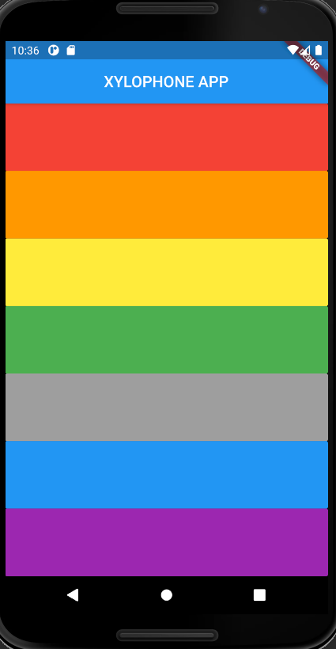
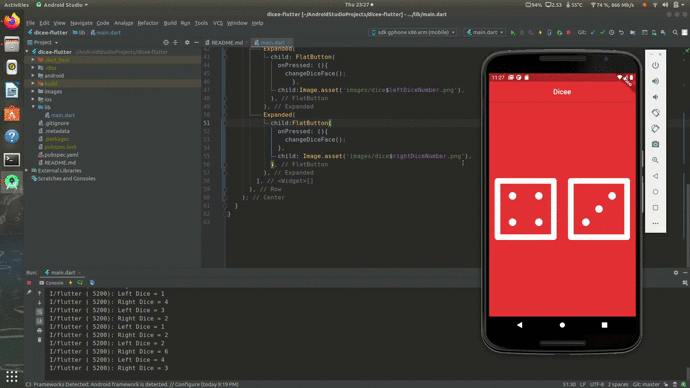

## Basic Flutter Applications

This repository contains the list of applications that I've been learning as a beginner in Flutter app development.

## Card Application

The first app that I've developed is a simple business card that contains the picture, job description, phone number as well as the email address of the concerned person.

## Xylophone Application

* The Xylophone app provides an on-screen xylophone which you can play with.

* Each colour on the screen represents a different musical note.

* You can tap on each note to hear the different musical sounds.

 

## Dicee Application

This is a simple dice app where a random number is generated on each dice when the user taps on the dice.

